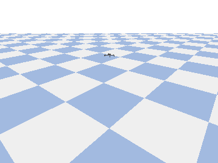
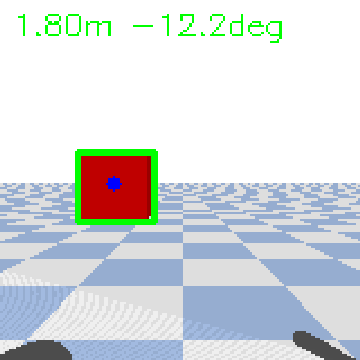
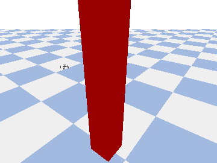

# nanodrone-ai

> **NanoDrone-AI: a sim-first, on-device autonomy stack for 27 g micro-drones — culminating in a tiny latent world model that anticipates collisions before they happen.**
>
> Beginner-friendly and step-by-step: start in simulation for $0, graduate to a real Crazyflie that flies itself fully offline.

🚀 **Completely new here?** Read [**Start here**](docs/en/START-HERE.md) — the goal in one sentence, your first flight, and the course map. Stuck on a word? The [Glossary](docs/en/GLOSSARY.md) explains the course's terms in plain language.

🌐 **Languages:** **English** · [繁體中文](README.zh-TW.md)

[](https://github.com/csinghans/nanodrone-ai/actions/workflows/ci.yml)
[](https://github.com/csinghans/nanodrone-ai/actions/workflows/docs.yml)
[](LICENSE)

---

## What is this?

This is an open-source course. It teaches you to build **edge-AI autonomy for a nano-drone** — the same idea as a self-driving car, shrunk down to a 27-gram quadcopter that runs a neural network **on-board** and flies itself **offline** (no laptop, no Wi-Fi, no cloud).

You will start writing code **today, for free**, entirely in a physics simulator on your Mac. Hardware is optional and only needed for the very last lesson.

**Who is this for?** Total beginners. Every lesson explains *why*, not just *how*.

## See it in action

All produced in simulation on a Mac, for free:

| Lesson 1 — hover | Lesson 2 — perception | Lesson 3 — RL avoidance |
|:---:|:---:|:---:|
|  |  |  |
| holds a 1 m hover | finds the obstacle (distance + bearing) | learns to fly *around* the pillar |

## The big idea: two layers (the AI never drives the motors directly)

```
┌─────────────────────────────────────────────────────────┐
│  Companion compute — YOUR AI                              │
│  Perception → Localization → Planning → high-level command │  ~10–30 Hz
│  (runs neural nets, reads the camera, decides where to go) │
└───────────────────────┬─────────────────────────────────┘
                        │ MAVLink-style setpoints (velocity / position)
┌───────────────────────▼─────────────────────────────────┐
│  Flight controller firmware (PX4 / ArduPilot / Crazyflie) │
│  Attitude stabilization, motor mixing, IMU feedback        │  ~400 Hz–1 kHz
└─────────────────────────────────────────────────────────┘
```

The **flight controller** keeps the drone from falling out of the sky (a hard real-time job — don't touch it). **Your AI** decides *where to go* and sends high-level commands. In simulation both layers run on your Mac; on real hardware your AI runs on the **AI-deck's GAP8 chip**.

## Learning path

| Lesson | Topic | Cost | You'll build |
|--------|-------|------|--------------|
| **0** | Setup & project skeleton | $0 | A working Python + simulator environment |
| **1** | Flight control basics | $0 | A script that flies a square path and lands |
| **2** | Perception | $0 | Obstacle detection from a simulated camera |
| **3** | Autonomous decision AI | $0 | A drone that avoids obstacles using *only* a neural net |
| **4** | Real hardware + on-board offline AI | ~US$545 | A Crazyflie flying itself with the laptop unplugged |
| **5** *(bonus)* | Fly it yourself (Xbox controller) | $0 | Teleoperate the sim drone with a gamepad |
| **6** | Follow-me tracking (visual servoing) | $0 | A drone that follows a moving target by camera |
| **7** | Follow the pilot | $0 | Drive a person; the drone follows & yaws to face you |
| **8** | Follow a real person (CNN) | $0 | A *trained* detector follows a person no colour rule can find |
| **9** | Voice-controlled flight | $0 | Fly by speaking — offline speech model, English + 中文 |
| **10** | Train your own voice commands | $0 | Train a keyword-spotting model on *your* voice |

**Beyond Lesson 10** (the post-L10 roadmap, now built — see [docs/en/ROADMAP.md](docs/en/ROADMAP.md)):

| Lesson | Topic | Cost | You'll build |
|--------|-------|------|--------------|
| **11** | Mission state machine + failsafe | $0 | Orchestrate phases (takeoff→go→land) on one `nanodrone.mission` state machine |
| **12** | Voice-driven mission transitions | $0 | Spoken commands switch whole phases, not just nudges |
| **13** | Multimodal mini-capstone | $0 | Take off → find a person → follow → land on "land" (re-trains a confirm CNN) |
| **14a** | Mapping & autonomous patrol | $0 | Build a 2D occupancy map from depth while patrolling |
| **14b** | On-board budget (quantize + latency) | $0 | Sew perception back to GAP8: int8 fit + latency-vs-tracking curve |
| **16** | Graduation project | $0 | Design + grade *your own* mission (template + validator + rubric) |
| **17** | Monocular depth estimation | $0 | Train a dense depth CNN from one camera (first dense model) |
| **18** | Optical flow / visual odometry | $0 | Estimate motion with no GPS from a downward camera |
| **19** | Harder multi-obstacle RL | $0 | Generalize avoidance over random layouts (perception in the obs) |
| **20** | Domain randomization | $0 | Shrink the sim-to-real gap by jittering training images |
| **21** | Distillation + compression | $0 | Shrink a model ~6× while keeping accuracy |
| **22** | Unified on-board policy | $0 | Distill avoid + follow into one tiny network |
| **23** | Flight black box | $0 | Telemetry logging + faithful replay |
| **24** | First real drone (Tello) | ~US$100 | Same protocol on a Wi-Fi Tello, plus a reusable safety layer |
| **25** | Measure the sim-to-real gap | $0 | Quantify how much a sim model loses on a real-ish camera |
| **26** | Field-test SOP + regulations | $0 | A GO/NO-GO pre-flight gate + Taiwan CAA checklist |
| **27** | Extract the flight protocol | $0 | One schema (`nanodrone.protocol`) reused everywhere |
| **28** | Parser arena (counter-example) | $0 | When a general model + constraints beats training your own |
| **29** | Nano world model (V-JEPA, on-board) | $0 | Predict the *next latent* at four horizons; a policy learned over it flies the whole 0.8–1.6 m/s sweep crash-free where reactive ends at 60 % (137 KB on-board budget) |
| **30** | Course summary | $0 | The whole arc by the numbers, plus a graduation check that re-asserts the course's shared contracts |
| **DroneVoice** | Apple app → on-device LLM → real drone | $0 sw | Fly by speaking from an iPhone (Phases 2–5; needs Apple hardware) |

Each lesson follows the same five-part shape: **Why → Concept → Hands-on → Checkpoint → Going further.**

## Quickstart (Lesson 0)

> Requires an **Apple Silicon Mac** (M1–M4). See [setup/install_macos.sh](setup/install_macos.sh).

```bash
# 1. Install miniforge (conda for Apple Silicon) if you don't have it
bash setup/install_macos.sh

# 2. Create the environment (also installs gym-pybullet-drones)
bash setup/install_env.sh
conda activate nanodrone-ai

# 3. Verify the GPU (MPS) backend is available
python -c "import torch; print('MPS available:', torch.backends.mps.is_available())"

# 4. Run your first simulated drone (hovers for 10 s)
python lessons/01_hover/hover_demo.py
```

A PyBullet window should open and show a tiny quadcopter holding a hover at 1 m. 🎉

## Cost: how cheap can this be?

- **Lessons 0–3 cost nothing** beyond a Mac you already own.
- **Lesson 4** (truly on-board, offline neural-net inference on a nano-drone) needs the [Bitcraze "AI bundle"](https://store.bitcraze.io/products/the-ai-bundle): **≈ US$545** (Crazyflie 2.1+, AI-deck 1.1 with the GAP8 chip, Flow deck v2, Crazyradio 2.0).
- There is no cheaper *credible* way to run a neural network on-board a nano-drone. A DJI Tello (≈ US$100) is great for practice but runs the AI **off-board over Wi-Fi**, which is not the offline goal of this course.

## Safety & legal

Real drone flight is regulated. Before flying hardware (Lesson 4): check your local rules (e.g. Taiwan's CAA remote-drone regulations), always fit **failsafes** (return/land on link loss, geofence, low-battery land), test in open areas, and keep a manual RC override ready. **Always validate in simulation first.**

## Contributing & translations

Contributions welcome — especially translation review. See [CONTRIBUTING.md](CONTRIBUTING.md) ([繁中](CONTRIBUTING.zh-TW.md)). English is the source language; the Traditional Chinese version follows it.

## Origins & credits

This course stands on the shoulders of these open-source projects:

- **[PULP-Dronet](https://github.com/pulp-platform/pulp-dronet)** (ETH Zürich /
  University of Bologna) — the foundational inspiration. It runs a CNN fully
  on-board a Crazyflie nano-drone (the GAP8 AI-deck) for autonomous navigation —
  exactly the offline, on-device autonomy this course builds toward. Lesson 3's
  Route B is a miniature of its approach, and Lesson 4 deploys onto the same
  hardware.
- **[gym-pybullet-drones](https://github.com/utiasDSL/gym-pybullet-drones)**
  (UTIAS DSL) — the PyBullet simulator and Crazyflie model used in Lessons 1–3.
- **[Bitcraze Crazyflie](https://www.bitcraze.io/)** — the open hardware
  platform and AI-deck targeted in Lesson 4.

## Where this goes next

The course is complete (v1.0) — see [COURSE_COMPLETE.md](COURSE_COMPLETE.md)
for what's core, what's advanced, and what's research preview. Want to go
deeper into micro-drone world models, latent planning, sim-to-real, and
on-device deployment? The research continues in
[**microdrone-world-model**](https://github.com/csinghans/microdrone-world-model).

## License

[MIT](LICENSE).
