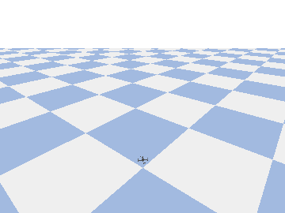
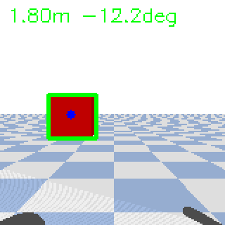
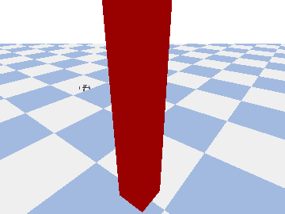

# nanodrone-ai

> **給新手的逐步學習歷程：打造奈米無人機的「板載 AI 自主飛行」— 從 $0 純模擬起步，最終做到一台完全離線自飛的 Crazyflie。**

🌐 **語言：** [English](README.md) · **繁體中文**

[](https://github.com/csinghans/nanodrone-ai/actions/workflows/ci.yml)
[](https://github.com/csinghans/nanodrone-ai/actions/workflows/docs.yml)
[](LICENSE)

---

## 這是什麼？

這是一套開源課程，教你打造**奈米無人機的邊緣 AI 自主導航** — 跟自駕車是同一個概念，只是縮小到一台 27 克的四旋翼：神經網路跑在**機身上**，**離線**自行飛行（不靠筆電、不靠 Wi-Fi、不靠雲端）。

你**今天就能免費開始寫程式**，全程在 Mac 上的物理模擬器裡進行。硬體是選配的，只有最後一課才會用到。

**適合誰？** 完全新手。每一課都會解釋「**為什麼**」，而不只是「怎麼做」。

## 實際成果

全部在 Mac 上用模擬器免費產生：

| Lesson 1 — 懸停 | Lesson 2 — 感知 | Lesson 3 — RL 避障 |
|:---:|:---:|:---:|
|  |  |  |
| 穩定懸停在 1 公尺 | 找到障礙物（距離 + 方位） | 學會**繞過**柱子 |

## 核心觀念：雙層架構（AI 永遠不直接控馬達）

```
┌─────────────────────────────────────────────────────────┐
│  伴隨運算 — 你的 AI                                          │
│  感知 → 定位 → 規劃 → 高階指令                               │  約 10–30 Hz
│  （跑神經網路、讀相機、決定往哪飛）                            │
└───────────────────────┬─────────────────────────────────┘
                        │ MAVLink 式 setpoint（速度／位置）
┌───────────────────────▼─────────────────────────────────┐
│  飛控韌體（PX4 / ArduPilot / Crazyflie）                    │
│  姿態穩定、馬達混控、IMU 回授                                 │  約 400 Hz–1 kHz
└─────────────────────────────────────────────────────────┘
```

**飛控**負責「不要從天上掉下來」（硬即時任務，別碰它）；**你的 AI** 負責「往哪飛」並送出高階指令。模擬階段兩層都在 Mac 上跑；上真機後，你的 AI 跑在 **AI-deck 的 GAP8 晶片**上。

## 學習路線

| 課程 | 主題 | 成本 | 你會做出 |
|------|------|------|----------|
| **0** | 環境建置與專案骨架 | $0 | 一個能跑的 Python + 模擬器環境 |
| **1** | 飛行控制基礎 | $0 | 讓無人機飛方形航線並降落的腳本 |
| **2** | 感知 | $0 | 從模擬相機偵測障礙物 |
| **3** | 自主決策 AI | $0 | 一台**只靠神經網路**避障的無人機 |
| **4** | 真機 + 板載離線 AI | 約 US$545 | 拔掉筆電也能自飛的 Crazyflie |
| **5** *(加成)* | 親手飛（Xbox 手把） | $0 | 用手把遙控模擬無人機 |

每一課都採同樣的五段式結構：**為什麼 → 概念 → 動手做 → 驗收 → 延伸閱讀。**

## 快速開始（Lesson 0）

> 需要 **Apple Silicon Mac**（M1–M4）。參見 [setup/install_macos.sh](setup/install_macos.sh)。

```bash
# 1. 若還沒裝，先安裝 miniforge（Apple Silicon 版 conda）
bash setup/install_macos.sh

# 2. 建立環境（同時會裝好 gym-pybullet-drones）
bash setup/install_env.sh
conda activate nanodrone-ai

# 3. 確認 GPU（MPS）後端可用
python -c "import torch; print('MPS available:', torch.backends.mps.is_available())"

# 4. 跑你的第一台模擬無人機（懸停 10 秒）
python lessons/01_hover/hover_demo.py
```

接著應該會跳出一個 PyBullet 視窗，看到一台小四旋翼穩定懸停在 1 公尺高。🎉

## 成本：這能多便宜？

- **Lesson 0–3 完全不用錢**（只要一台你已經有的 Mac）。
- **Lesson 4**（真正在奈米機上、離線跑神經網路推論）需要 [Bitcraze「AI bundle」](https://store.bitcraze.io/products/the-ai-bundle)：**約 US$545**（含 Crazyflie 2.1+、帶 GAP8 晶片的 AI-deck 1.1、Flow deck v2、Crazyradio 2.0）。
- 奈米機要在機上跑神經網路，目前**沒有更便宜的可信方案**。DJI Tello（約 US$100）很適合練習，但 AI 是**透過 Wi-Fi 跑在機外**，不符合本課程「離線」的目標。

## 安全與法規

真機飛行受法規管制。動硬體（Lesson 4）前：先查當地規定（例如台灣民航局「遙控無人機管理規則」）、一定要設 **failsafe**（失聯返航/降落、地理圍欄、低電降落）、在空曠處測試、隨時備好可手動接管的 RC 遙控器。**永遠先在模擬器驗證。**

## 參與貢獻與翻譯

歡迎貢獻 — 尤其是翻譯校對。請見 [CONTRIBUTING.zh-TW.md](CONTRIBUTING.zh-TW.md)（[English](CONTRIBUTING.md)）。英文為來源語言，繁體中文版跟進更新。

## 專案起源與致謝

本課程站在這些開源專案的肩膀上：

- **[PULP-Dronet](https://github.com/pulp-platform/pulp-dronet)**（ETH Zürich／
  Bologna 大學）—— **核心靈感來源**。它讓一個 CNN 完全跑在 Crazyflie 奈米無人機
  的機身上（GAP8 AI-deck）做自主導航 —— 正是本課程要打造的「離線、板載」自主能力。
  Lesson 3 的 Route B 就是它做法的縮影，Lesson 4 更會部署到同一套硬體。
- **[gym-pybullet-drones](https://github.com/utiasDSL/gym-pybullet-drones)**
  （UTIAS DSL）—— Lesson 1–3 使用的 PyBullet 模擬器與 Crazyflie 模型。
- **[Bitcraze Crazyflie](https://www.bitcraze.io/)** —— Lesson 4 鎖定的開源硬體
  平台與 AI-deck。

## 授權

[MIT](LICENSE)。
