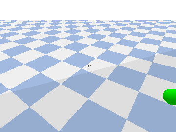

# Lesson 6 — Follow-me tracking

🌐 **English** (below) · [跳到繁體中文](#中文)



---

## Why

Lessons 2 and 3 detected and avoided a *static* obstacle. Following a *moving*
target is the next step — and it's how "follow-me" drones, sports filming, and
inspection bots work. This lesson closes the full loop **see → locate → move**
with a simple, debuggable rule (no training required).

## Concept

This is **visual servoing**: control driven by what the camera sees. Each
perception tick:

1. **Detect** the green target (HSV blob, exactly like Lesson 2) → its *bearing*
   and *elevation* in the image.
2. **Range** it from the depth image at the blob centroid.
3. **Reconstruct** the target's world position from the drone's pose + that
   bearing/elevation/distance.
4. **Decide** a standoff point `DESIRED_DIST` behind the target and hand it to
   the PID flight controller (Lesson 1's layer), which flies there.

Perception runs slower than control (every `PERCEPTION_EVERY` steps), just like
real systems. The drone keeps the target centred and a fixed distance ahead, so
it trails wherever the target sweeps.

## Hands-on

```bash
conda activate nanodrone-ai
python lessons/06_follow_me/follow_me.py            # opens a window
python lessons/06_follow_me/follow_me.py --headless # no window (CI / verify)
```

Read [`follow_me.py`](follow_me.py): `detect_blob()` (from the shared `nanodrone`
core — the detector first written in Lesson 2) finds the target, `world_point()`
turns its bearing + depth into a world point, and the standoff line is the whole
"follow" rule.

## Checkpoint ✅

Headless prints (verified on this machine):

```
FOLLOW OK: tracked 63 frames, mean bearing error 5.3 deg.
```

A mean bearing error of just a few degrees means the drone kept the target near
the centre of its view the whole time — it followed. In the GUI you'll see the
quad trailing the green sphere as it sweeps side to side.

## Going further

- **Add yaw** so the drone *turns* to face the target instead of strafing —
  then it can follow a target that circles all the way around it.
- **Swap the detector for Lesson 3's CNN** to follow by learned features instead
  of a color threshold.
- **Add a lead/lag filter** on the target estimate to handle detection dropouts
  smoothly.

---

<a name="中文"></a>
# Lesson 6 — 跟隨模式

🌐 [English](#lesson-6--follow-me-tracking) · **繁體中文**（以下）

## 為什麼

Lesson 2、3 偵測並避開*靜止*障礙；跟隨一個*移動*目標是下一步 —— 這正是「follow-me」空拍、運動攝影、巡檢機器人的運作方式。這一課用一個簡單、可除錯的規則（不需訓練）閉合完整迴圈 **看見 → 定位 → 移動**。

## 概念

這是**視覺伺服（visual servoing）**：用相機看到的東西來驅動控制。每個感知 tick：

1. **偵測**綠色目標（HSV 色塊，與 Lesson 2 完全相同）→ 影像中的*方位*與*仰角*。
2. 從深度影像在形心處**測距**。
3. 由無人機姿態 + 方位/仰角/距離**重建**目標的世界座標。
4. **決策**一個在目標後方 `DESIRED_DIST` 的尾隨點，交給 PID 飛控（Lesson 1 的那層）飛過去。

感知比控制慢（每 `PERCEPTION_EVERY` 步才跑一次），跟真實系統一樣。無人機把目標保持在畫面中央、維持固定距離，於是目標往哪掃，它就跟到哪。

## 動手做

```bash
conda activate nanodrone-ai
python lessons/06_follow_me/follow_me.py            # 開視窗
python lessons/06_follow_me/follow_me.py --headless # 不開視窗（CI / 驗證）
```

請讀 [`follow_me.py`](follow_me.py)：`detect_blob()`（來自共用核心 `nanodrone`，就是 Lesson 2 最早手寫的偵測器）找出目標，`world_point()` 把方位 + 深度換成世界座標，尾隨點那條線就是整個「跟隨」規則。

## 驗收 ✅

headless 會印出（本機實測）：

```
FOLLOW OK: tracked 63 frames, mean bearing error 5.3 deg.
```

平均方位誤差只有幾度，代表無人機全程把目標保持在畫面中央 —— 它確實跟上了。在 GUI 裡你會看到四旋翼尾隨綠色球體左右擺動。

## 延伸

- **加入 yaw**，讓無人機*轉向*面對目標而非平移 —— 就能跟隨繞著它轉一圈的目標。
- **把偵測器換成 Lesson 3 的 CNN**，用學到的特徵跟隨，而非色彩門檻。
- 在目標估計上加**超前/滯後濾波**，平順處理偵測中斷。
