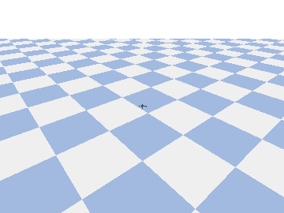

# Lesson 9 — Voice-controlled flight

🌐 **English** (below) · [跳到繁體中文](#中文)



---

> **In one line:** Speak and the drone obeys: an offline speech model turns your English or Chinese words into flight commands, no internet needed. · **Builds on:** L8

## Why

Talk, and the drone flies. This is the most natural interface yet — and another
"needs a trained model" capability: an **offline speech model** turns your voice
into words, on your machine, no cloud. It also speaks **both English and 中文**.

## Concept

Same layered idea as ever, with one new layer on top:

- **Speech → text:** [Vosk](https://alphacephei.com/vosk/) — a trained neural
  net that runs offline. Pick the model with `--lang en` or `--lang zh`.
- **Text → command:** `parse_command()` — a tiny bilingual keyword table, so
  "forward" and "前進" both mean the same thing.
- **Command → flight:** the PID controller flies body-frame, exactly like the
  Lesson 5 teleop (a command sets a persistent velocity until the next one).

Commands are bilingual:

| Action | English | 中文 |
|--------|---------|------|
| take off / hold | takeoff, stop, hover | 起飛、停止、懸停 |
| forward / back | forward / back | 前進 / 後退 |
| left / right (strafe) | left / right | 向左 / 向右 |
| up / down | up / down | 上升 / 下降 |
| turn | turn left / turn right | 左轉 / 右轉 |
| land | land | 降落 |

## Hands-on

```bash
conda activate nanodrone-ai
pip install -r setup/requirements-extra.txt           # vosk + sounddevice

# Download a Vosk model and unzip it next to voice.py:
#   English -> lessons/09_voice/model-en/   (vosk-model-small-en-us)
#   中文    -> lessons/09_voice/model-zh/   (vosk-model-small-cn)
# from https://alphacephei.com/vosk/models

python lessons/09_voice/voice.py --lang en           # speak English
python lessons/09_voice/voice.py --lang zh            # 講中文
python lessons/09_voice/voice.py --selftest           # scripted, no mic (CI)
```

Read [`voice.py`](voice.py): `parse_command()` is the bilingual rule table,
`listen_vosk()` is the offline model, and the flight loop is Lesson 5's.

## Checkpoint ✅

`--selftest` runs a scripted mix of English + 中文 commands (takeoff → 前進 →
turn left → 上升 → stop → 降落) and prints (verified on this machine):

```
VOICE OK: ran 463 steps, moved 1.60 m, yaw 69 deg, landed.
```

With a Vosk model and a mic, say the commands and watch the drone obey — in
either language.

## Going further

- **Mix languages live:** run two Vosk recognizers (en + zh) on the same audio
  so you can switch language mid-flight.
- **More commands:** "flip", "go home", "faster" — extend the keyword table.
- **Wake word:** require "drone, ..." before a command to avoid false triggers.

---

<a name="中文"></a>
# Lesson 9 — 語音操控飛行

🌐 [English](#lesson-9--voice-controlled-flight) · **繁體中文**（以下）

> **一句話：**開口就能指揮無人機：離線語音模型把你的中英文口令變成飛行指令，完全不用網路。 · **建立在：**第 8 課

## 為什麼

開口說，無人機就飛。這是目前最自然的介面 —— 也是又一個「需要訓練模型」的能力：用**離線語音模型**把你的聲音轉成文字，在你機器上跑、不靠雲端。而且**中英文都支援**。

## 概念

跟以往一樣的分層，只是最上面多一層：

- **語音 → 文字：** [Vosk](https://alphacephei.com/vosk/) —— 一個離線執行的訓練好神經網路。用 `--lang en` 或 `--lang zh` 選模型。
- **文字 → 指令：** `parse_command()` —— 一張小小的雙語關鍵字表，所以「forward」和「前進」是同一件事。
- **指令 → 飛行：** PID 以機體座標飛行，就跟 Lesson 5 遙控一樣（一個指令設定持續速度，直到下一個指令）。

指令雙語對照：

| 動作 | English | 中文 |
|------|---------|------|
| 起飛／停懸 | takeoff, stop, hover | 起飛、停止、懸停 |
| 前進／後退 | forward / back | 前進 / 後退 |
| 左右平移 | left / right | 向左 / 向右 |
| 上升／下降 | up / down | 上升 / 下降 |
| 轉向 | turn left / turn right | 左轉 / 右轉 |
| 降落 | land | 降落 |

## 動手做

```bash
conda activate nanodrone-ai
pip install -r setup/requirements-extra.txt           # vosk + sounddevice

# 下載 Vosk 模型並解壓到 voice.py 旁：
#   英文 -> lessons/09_voice/model-en/   (vosk-model-small-en-us)
#   中文 -> lessons/09_voice/model-zh/   (vosk-model-small-cn)
# 來源：https://alphacephei.com/vosk/models

python lessons/09_voice/voice.py --lang en           # 講英文
python lessons/09_voice/voice.py --lang zh            # 講中文
python lessons/09_voice/voice.py --selftest           # 腳本化、不用麥克風（CI）
```

請讀 [`voice.py`](voice.py)：`parse_command()` 是雙語規則表、`listen_vosk()` 是離線模型，飛行迴圈沿用 Lesson 5。

## 驗收 ✅

`--selftest` 會跑一段中英混合命令（takeoff → 前進 → turn left → 上升 → stop → 降落）並印出（本機實測）：

```
VOICE OK: ran 463 steps, moved 1.60 m, yaw 69 deg, landed.
```

裝好 Vosk 模型 + 麥克風後，講出命令就能看無人機照做 —— 中英文皆可。

## 延伸

- **即時混語：** 對同一段音訊同時跑 en + zh 兩個 Vosk 辨識器，飛行中隨時切語言。
- **更多指令：** 「翻滾」「返航」「加速」等 —— 擴充關鍵字表即可。
- **喚醒詞：** 命令前要求先說「無人機，…」以避免誤觸發。
