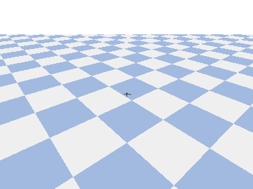

# Lesson 10 — Train your own voice commands

🌐 **English** (below) · [跳到繁體中文](#中文)



---

> **In one line:** Record your own voice and train a small model on it, so the drone understands your exact accent better than the generic model. · **Builds on:** L9

## Why

Lesson 9's generic speech model struggled with some accents. The fix is the
course's recurring lesson: when a general model isn't good enough, **train a
small one on your own data**. Here that data is *your voice* saying the
commands — so the model learns your exact pronunciation and accent.

## Concept

This is **keyword spotting** (KWS): classify a short audio clip into one of a few
fixed commands. Three steps, all on-device:

1. **Record** — say each command a few times; we keep the **MFCC** of each clip
   (a compact audio "image"). That's your dataset (`kws.py:wav_to_feat`).
2. **Train** — a small CNN (`make_net`) learns clip → command, exactly like the
   image CNNs in Lessons 3 and 8 (MFCC is just a 44×13 image).
3. **Fly** — classify each ~1 s mic window with *your* model and drive the drone
   (world-frame, same PID controller).

Commands: forward, back, left, right, up, down, stop, land — plus a
**background** class (silence/ambient) so *not* speaking is ignored instead of
triggering a random command (the main reason naive KWS feels inaccurate).

## Hands-on

```bash
conda activate nanodrone-ai
pip install -r setup/requirements-extra.txt          # sounddevice + python_speech_features

python lessons/10_voice_train/record_commands.py --reps 12  # 1. auto-record each + silence
python lessons/10_voice_train/train_kws.py                  # 2. train on your voice
python lessons/10_voice_train/kws_fly.py                    # 3. fly with your model

# No mic? Verify the whole pipeline with fake data:
python lessons/10_voice_train/record_commands.py --synthetic 16
python lessons/10_voice_train/train_kws.py
python lessons/10_voice_train/kws_fly.py --selftest
```

> **Record in any language.** The labels are just ids, so at each prompt you can
> say the 中文 word (前進, 上升, 降落, …) — or anything — and use the same word
> when flying. The recorder shows the suggested 中文 word next to each command.

Read [`kws.py`](kws.py) (features + model + commands), then `record_commands.py`,
`train_kws.py`, `kws_fly.py`.

## Checkpoint ✅

Training prints rising accuracy (synthetic pipeline reaches 100%; on your own
clean recordings expect high accuracy on these distinct words):

```
  epoch 40  val accuracy = 100%
```

And the scripted flight verifies the command→flight path with no mic:

```
KWS-FLY OK: ran 439 steps, moved 1.79 m, landed.
```

With your trained model and a mic, say the commands and watch it obey — tuned to
*your* voice.

## Going further

- **More commands / your own words:** add labels to `kws.COMMANDS` and re-record.
- **Robustness:** record in your real flying environment (background noise) and
  add a "background/none" class so silence doesn't trigger a command.
- **Streaming:** replace the 1 s windows with a sliding window + voice-activity
  detection for snappier response.

---

<a name="中文"></a>
# Lesson 10 — 訓練你自己的語音命令

🌐 [English](#lesson-10--train-your-own-voice-commands) · **繁體中文**（以下）

> **一句話：**錄下自己的聲音訓練一個小模型，讓無人機聽得懂你的口音，比通用模型更準。 · **建立在：**第 9 課

## 為什麼

Lesson 9 的通用語音模型對某些口音辨識不佳。解法正是課程一再出現的主題：**通用模型不夠好時，就用自己的資料訓練一個小的**。這裡的資料就是*你的聲音*唸命令 —— 模型學的是你本人的發音與口音。

## 概念

這是**關鍵詞辨識（KWS）**：把一小段音訊分類成少數固定命令之一。三步，全部在本機：

1. **錄音** —— 每個命令唸幾次；我們保留每段的 **MFCC**（精簡的音訊「影像」），就是你的資料集（`kws.py:wav_to_feat`）。
2. **訓練** —— 小 CNN（`make_net`）學「音訊片段 → 命令」，跟 Lesson 3、8 的影像 CNN 一樣（MFCC 就是一張 44×13 的圖）。
3. **飛行** —— 用*你的*模型分類每個約 1 秒的麥克風視窗，驅動無人機（世界座標、同一個 PID）。

命令：forward、back、left、right、up、down、stop、land —— 外加一個 **background**（安靜/環境音）類別，讓你*沒講話*時被忽略、不會亂觸發命令（這正是 naive KWS 感覺不準的主因）。

## 動手做

```bash
conda activate nanodrone-ai
pip install -r setup/requirements-extra.txt          # sounddevice + python_speech_features

python lessons/10_voice_train/record_commands.py --reps 12  # 1. 自動連錄每個命令 + 安靜
python lessons/10_voice_train/train_kws.py                  # 2. 用你的聲音訓練
python lessons/10_voice_train/kws_fly.py                    # 3. 用你的模型飛

# 沒麥克風？用合成資料驗證整條管線：
python lessons/10_voice_train/record_commands.py --synthetic 16
python lessons/10_voice_train/train_kws.py
python lessons/10_voice_train/kws_fly.py --selftest
```

> **可用任何語言錄音。** 標籤只是代號，所以每個提示你都可以唸中文（前進、上升、降落…）—— 或任何聲音 —— 飛行時講一樣的詞即可。錄音程式會在每個命令旁顯示建議的中文詞。

請讀 [`kws.py`](kws.py)（特徵 + 模型 + 命令），再看 `record_commands.py`、`train_kws.py`、`kws_fly.py`。

## 驗收 ✅

訓練會印出上升的準確率（合成管線可達 100%；用你乾淨的錄音，這些差異大的詞也能有高準確率）：

```
  epoch 40  val accuracy = 100%
```

腳本化飛行則在無麥克風下驗證「命令→飛行」：

```
KWS-FLY OK: ran 439 steps, moved 1.79 m, landed.
```

裝好你訓練的模型 + 麥克風後，講出命令就能看它照做 —— 為*你的*聲音量身訂做。

## 延伸

- **更多命令／自訂詞：** 在 `kws.COMMANDS` 加標籤再重錄。
- **抗噪：** 在你真正飛的環境（有背景噪音）錄音，並加一個「背景/無命令」類別，避免靜音誤觸發。
- **串流：** 把 1 秒視窗換成滑動視窗 + 語音活動偵測（VAD），反應更即時。
